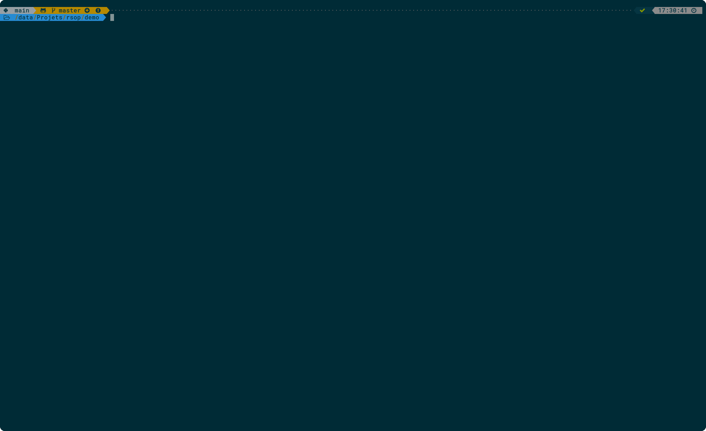

# rsop

[](https://github.com/desbma/rsop/actions)
[](https://aur.archlinux.org/packages/rsop-open/)
[](https://github.com/desbma/rsop/blob/master/LICENSE)

Simple, fast & configurable tool to open and preview files.

Ideal for use with terminal file managers (ranger, lf, nnn, yazi, etc.). Can also be used as a general alternative to `xdg-open` and its various clones.

If you spend most time in a terminal, and are unsatisfied by current solutions to associate file types with handler programs, this tool may be for you.

## Features

- Start program to view/edit file according to extension or MIME type
- Provides 4 commands (all symlinks to a single `rsop` binary):
  - `rso`: open file
  - `rse`: edit file (similar to `rso` in most cases, except when open to view or edit have a different handler)
  - `rsp`: preview files in terminal, to be used for example in terminal file managers or [`fzf`](https://github.com/junegunn/fzf) preview panel
  - `rsi`: to identify MIME type
- Supports opening and previewing from data piped on stdin (very handy for advanced shell scripting, see [below](#show-me-some-cool-stuff-rsop-can-do))
- Supports chainable filters to preprocess data (for example to transparently handle `.log.xz` files)
- Simple config file (no regex or funky conditionals) to describe file formats, handlers, and associate both
- [`xdg-open`](https://linux.die.net/man/1/xdg-open) compatibility mode

Compared to other `xdg-open` alternatives:

- `rsop` is consistent and accurate, unlike say [ranger](https://github.com/ranger/ranger/issues/1804)
- `rsop` does not rely on `.desktop` files (see section [Why no .desktop support](#why-no-desktop-support))
- `rsop` does opening and previewing with a single self contained tool and config file
- `rsop` is not tied to a file manager or a runtime environment, you only need the `rsop` binary and your config file and can use it in interactive terminal sessions, file managers, `fzf` invocations...
- `rsop` is taylored for terminal users (especially the preview feature)
- `rsop` is very fast (see [performance](#performance) section)

## Installation

### From source

You need a Rust build environment for example from [rustup](https://rustup.rs/).

```
cargo build --release
install -Dm 755 -t /usr/local/bin target/release/rsop
ln -rsv /usr/local/bin/rs{op,p}
ln -rsv /usr/local/bin/rs{op,o}
ln -rsv /usr/local/bin/rs{op,e}
ln -rsv /usr/local/bin/rs{op,i}
# to replace system xdg-open:
ln -rsv /usr/local/bin/{rsop,xdg-open}
```

### From the AUR

Arch Linux users can install the [rsop-open AUR package](https://aur.archlinux.org/packages/rsop-open/).

## Configuration

When first started, `rsop` will create a minimal configuration file usually in `~/.config/rsop/config.toml`.

See comments and example in that file to set up file types and handlers for your needs.

A more advanced example configuration file is also available [here](./config/config.toml.advanced).

### Usage with [ranger](https://github.com/ranger/ranger)

**Warning: because ranger is built on Python's old ncurses version, the preview panel only supports 8bit colors (see https://github.com/ranger/ranger/issues/690#issuecomment-255590479), so if the output seems wrong you may need to tweak handlers to generate 8bit colors instead of 24.**

In `rifle.conf`:

    = rso "$@"

In `scope.sh`:

    #!/bin/sh
    COLUMNS="$2" LINES="$3" exec rsp "$1"

Dont forget to make it executable with `chmod +x ~/.config/ranger/scope.sh`.

### Usage with [lf](https://github.com/gokcehan/lf)

Add in `lfrc`:

    set filesep "\n"
    set ifs "\n"
    set previewer ~/.config/lf/preview
    cmd open ${{
       for f in ${fx[@]}; do rso "${f}"; done
       lf -remote "send $id redraw"
    }}

And create `~/.config/lf/preview` with:

    #!/bin/sh
    COLUMNS="$2" LINES="$3" exec rsp "$1"

## Usage with [yazi](https://github.com/sxyazi/yazi)

Yazi has a complex LUA plugin system. Some built in previewers are superior to what `rsp` can provide (integrated image preview, seeking...), however in most cases `rsop` is more powerful and flexible, so this configuration mixes both built-in previewers and calls to `rsp`. Keep in mind the Yazi plugin API is not yet stable so this can break and requires changing frequently.

<details>
    <summary>~/.config/yazi/yazi.toml</summary>

```yaml
[plugin]
previewers = [
  { name = "*/", run = "folder" },
  { mime = "image/{avif,hei?,jxl,svg+xml}", run = "magick" },
  { mime = "image/*", run = "image" },
  { mime = "font/*", run = "font" },
  { mime = "application/vnd.ms-opentype", run = "font" },
  { mime = "application/pdf", run = "pdf" },
  { mime = "video/*", run = "video" },
  { mime = "inode/empty", run = "empty" },
  { name = "*", run = "rsp" },
]

[opener]
open = [
  { run = 'rso "$1"', desc = "Open", block = true },
]
edit = [
  { run = 'rse "$1"', desc = "Edit" },
]
edit_block = [
  { run = 'rse "$1"', desc = "Edit (blocking)", block = true },
]

[open]
rules = [
  { mime = "application/{,g}zip", use = [ "open", "extract" ] },
  { mime = "application/{tar,bzip*,7z*,xz,rar}", use = [ "open", "extract" ] },
  { mime = "text/*", use = [ "open", "edit_block" ] },
  { name = "*", use = [ "open", "edit", "edit_block" ] },
]
```

</details>

<details>
    <summary>~/.config/yazi/plugins/rsop/main.lua</summary>

```lua
local M = {}

function M:peek(job)
    local child = Command("rsp")
        :args({
            tostring(job.file.url),
        })
        :env("COLUMNS", tostring(job.area.w))
        :env("LINES", tostring(job.area.h))
        :stdout(Command.PIPED)
        :stderr(Command.PIPED)
        :spawn()

    if not child then
        return require("code").peek(job)
    end

    local limit = job.area.h
    local i, lines = 0, ""
    repeat
        local next, event = child:read_line()
        if event == 1 then
            return require("code").peek(job)
        elseif event ~= 0 then
            break
        end

        i = i + 1
        if i > job.skip then
            lines = lines .. next
        end
    until i >= job.skip + limit

    child:start_kill()
    if job.skip > 0 and i < job.skip + limit then
        ya.emit("peek", { math.max(0, i - limit), only_if = job.file.url, upper_bound = true })
    else
        lines = lines:gsub("\t", string.rep(" ", rt.preview.tab_size))
        ya.preview_widgets(job, {
            ui.Text.parse(lines):area(job.area):wrap(rt.preview.wrap == "yes" and ui.Text.WRAP or ui.Text.WRAP_NO),
        })
    end
end

function M:seek(job) require("code"):seek(job) end

return M
```

</details>

## Show me some cool stuff `rsop` can do

- Simple file explorer with fuzzy searching, using [fd](https://github.com/sharkdp/fd) and [fzf](https://github.com/junegunn/fzf), using `rso` to preview files and `rsp` to open them:

```
fd . | fzf --preview='rsp {}' | xargs -r rso
```

[](https://raw.githubusercontent.com/desbma/rsop/master/demo/file-explorer.gif)

- Preview files inside an archive, **without decompressing it entirely**, select one and open it (uses [`bsdtar`](https://www.libarchive.org/), [`fzf`](https://github.com/junegunn/fzf) and `rso`/`rsp`):

```
# preview archive (.tar, .tar.gz, .zip, .7z, etc.)
# usage: pa <archive file path>
pa() {
    local -r archive="${1:?}"
    bsdtar -tf "${archive}" |
        grep -v '/$' |
        fzf --preview="bsdtar -xOf \"${archive}\" {} | rsp" |
        xargs -r bsdtar -xOf "${archive}" |
        rso
}
```

[](https://raw.githubusercontent.com/desbma/rsop/master/demo/preview-archive.gif)

**This is now integrated in the [advanced config example](./config/config.toml.advanced), so you can just run `rso <archive>` and get the same result.**

## Performance

`rsop` is quite fast. In practice it rarely matters because choosing with which program to open or preview files is usually so quick it is not perceptible. However performance can matter if for example you are decompressing a huge `tar.gz` archive to preview its content.
To help with that, `rsop` uses the [`splice` system call](https://man7.org/linux/man-pages/man2/splice.2.html) if available on your platform. In the `.tar.gz` example this allows decompressing data with `gzip` or `pigz` and passing it to tar (or whatever you have configured to handle `application/x-tar` MIME type), **without wasting time to copy data in user space** between the two programs. This was previously done using a custom code path, but is now done [transparently](https://github.com/rust-lang/rust/pull/75272) by the standard library.

Other stuff `rsop` does to remain quick:

- it is written in Rust (setting aside the RiiR memes, this avoid the 20-50ms startup time of for example Python interpreters)
- it uses hashtables to search for handlers from MIME types or extensions in constant time
- it uses the great [tree_magic_mini crate](https://crates.io/crates/tree_magic_mini) for fast MIME identification

## FAQ

### Why no [`.desktop`](https://specifications.freedesktop.org/desktop-entry-spec/latest/) support?

- `.desktop` do not provide a _preview_ action separate from _open_.
- One may need to pipe several programs to get to desired behavior, `.desktop` files does not help with this.
- Many programs do not ship one, especially command line tools, so this would be incomplete anyway.
- On a philosophical level, with `.desktop` files, the program's author (or packager) decides which MIME types to support, and which arguments to pass to the program. This is a wrong paradidm, as this is fundamentally a user's decision.

### What does `rsop` stands for?

"**R**eally **S**imple **O**pener/**P**reviewer" or "**R**eliable **S**imple **O**pener/**P**reviewer" or "**R**u**S**t **O**pener/**P**reviewer"

I haven't really decided yet...

### What is the difference between the open, edit and preview actions?

Each action has customizable handlers, so they only do what you set them to do.

However the philosophy is the following :

- preview is **non interactive**, typically with only terminal UI, and a maximum number of lines in the output
- open can be interactive or not, and can open graphical windows or not
- edit is **interactive**, defaults to the open handler if no edit handler is set, and only makes sense if you need an action separate from open, for example to edit images with GIMP versus to view them with just an image viewer

## License

[MIT](./LICENSE)
